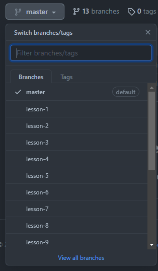

# node-crash-course
Course files for the Node.js Crash Course tutorial series on The Net Ninja YouTube channel.

## How to use
The code for each lesson is kept in separate branches – `lesson-1`, `lesson-2`, `lesson-3`, etc. Click on the **Branches** drop-down in the top left-hand corner of the page, select the branch that corresponds to the lesson you're currently on, and the code for that lesson will be available to you.

